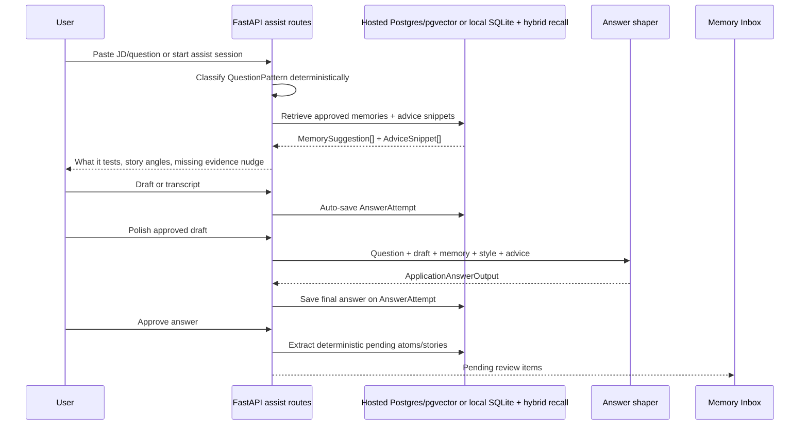

# AskPicky Memory Architecture

*Last updated 2026-06-02.*

This document is the implementation reference for application-assist memory.
It turns the planning concept of a "living profile" into a private evidence
graph that can be used quickly while a user is filling out an application.

The design follows the audit-prompt lenses:

- **LLM quality:** deterministic classify/retrieve/nudge first; LLMs only
  shape or extract after the user has supplied evidence.
- **Data privacy:** raw drafts expire, extracted memory is reviewable, and
  sensitive content defaults private.
- **API contract:** every public route has a typed request/response model.
- **Test coverage:** cheap smoke tests cover the non-LLM path; live agent
  smoke tests are mockable behind environment flags.

---

## Product Loop



The main UX rule: AskPicky coaches before it writes. The fast path gives the
user one useful nudge without waiting for a large model. Final polish is a
separate action.

---

## Product Surfaces

The hosted web app is the source of truth. The browser and desktop companions
are delivery surfaces over the same memory/API contract, not separate products.

| Version | Surface | Memory role |
|---|---|---|
| V1 | Hosted web app | User pastes JD/question, drafts answer, approves output, reviews Memory Inbox. |
| V2 | Chrome MV3 companion | Detects the active application form/question, opens an overlay, calls `/api/assist/*`, and copies/writes approved text back. |
| V3 | Electron companion | Later screen/audio/system control for power users after the hosted loop is proven. |

Hosted V2 targets Supabase Auth and Supabase Postgres/pgvector for canonical
multi-user memory. The migration/RLS contract is committed under
`supabase/migrations/`; runtime Postgres mode fails closed until the async
adapter lands. SQLite/FAISS remains the local OSS/dev storage path.

Chrome detection is confidence-based:

- site adapters for common ATS/job boards first
- generic DOM label/textarea fallback second
- manual highlight/send-to-AskPicky fallback when confidence is low
- no auto-apply and no silent submission

Chrome auth uses the hosted Supabase session. The hosted web app creates a
short-lived pairing token, the extension exchanges it with the matching
Supabase access token, and all assist calls continue to use bearer auth.

---

## Data Model

No graph database is used in v1. The graph is represented by relational rows
with JSON payloads and weighted `MemoryEdge` relationships.

| Object | Storage table | Purpose |
|---|---|---|
| `ApplicationAssistSession` | `application_assist_sessions` | Per form/JD context: company, role, JD text, private mode. |
| `AnswerAttempt` | `answer_attempts` | Question, draft/transcript, final answer, selected memories, word limit, retention metadata. |
| `ExperienceAtom` | `experience_atoms` | Smallest sourced fact about the user: skill, metric, project, result, responsibility, preference, constraint. |
| `StoryFrame` | `story_frames` | Reusable story assembled from atoms with multiple angles such as technical, leadership, stakeholder, values. |
| `MemoryEdge` | `memory_edges` | Weighted relationship between atoms, stories, questions, roles, and outcomes. |
| `AdviceSnippet` | `advice_snippets` | Curated public guidance with URL/source/licence metadata. Used for rubrics, not user facts. |

The older `CareerEntry` store remains valid and is included in recall. The new
objects add provenance, review status, visibility, outcome weighting, and
question-pattern targeting.

---

## Privacy Rules

Application assist auto-saves because the product needs compounding memory, but
auto-save is deliberately constrained:

- `AnswerAttempt.raw_retention_until` defaults to 30 days.
- `ExperienceAtom` and `StoryFrame` remain until the user deletes them.
- Sensitive detection marks visa, sponsorship, salary, health, family
  constraints, and direct contact details as private by default.
- Application assist uses **private save by default**. Private attempts and
  derived memories are excluded from normal recall.
- Private memories are excluded from suggestions unless the caller explicitly
  opts into private recall.
- Newly extracted memories start as `review_status="pending"`.
- Expired raw drafts/transcripts can be purged while answer metadata and final
  approved text remain for provenance.

The Memory Inbox is the user-visible review gate. Users can approve, keep
private, hide, edit, export, soft-delete, hard-delete, or merge. Merge keeps a
tombstone on source items so provenance is not silently lost.

---

## Fast Retrieval

`Storage.retrieve_application_memory_suggestions(...)` uses a hybrid path:

```text
score =
  semantic career-entry match
  + exact lexical overlap
  + question_type match
  + outcome_score boost
  - overuse penalty
  - private/pending exclusion
```

Current implementation:

- Deterministic rules classify `QuestionPattern`.
- FAISS recall over existing `CareerEntry` rows provides semantic matching.
- Lexical scoring catches exact technologies, employers, sectors, behaviours,
  and question wording.
- Approved `StoryFrame` rows get a question-type boost and outcome-score boost.
- Pending rows never influence suggestions.
- Normal recall excludes private rows; private recall is opt-in.

This keeps classify + retrieve + nudge cheap and suitable for a sub-2s live
assist loop. The slower LLM memory extractor is feature-flagged behind
`settings.enable_memory_extractor_llm` and is not on the critical path.

---

## Agents

Two LLM-backed components follow the seven-step sub-agent pattern:

| Agent | Tier | Runtime role | Prompt | Schema | Smoke test |
|---|---|---|---|---|---|
| `application_answer_shaper` | normal | User-facing final answer polish. | `src/askpicky/prompts/application_answer_shaper.md` | `ApplicationAnswerOutput` | `scripts/smoke_tests/application_answer_shaper.py` |
| `memory_extractor` | fast | Optional background extraction from approved answers. | `src/askpicky/prompts/memory_extractor.md` | `MemoryExtractionOutput` | `scripts/smoke_tests/memory_extractor.py` |

Both are registered with Content Shield and `scripts/audit_prompt.py`.

The deterministic extractor in `memory/application_assist.py` always runs after
approval so Memory Inbox works without extra LLM spend. The LLM extractor can
add richer atoms/story frames later, but it is not required for the user to see
value.

---

## API Routes

All routes are mounted under `/api`.

| Method | Path | Purpose |
|---|---|---|
| `POST` | `/assist/start` | Create an `ApplicationAssistSession`. |
| `POST` | `/assist/classify-question` | Return deterministic `QuestionPattern`. |
| `POST` | `/assist/suggest-memory` | Return relevant memories and advice snippets. |
| `POST` | `/assist/critique-draft` | Score draft against rubric, auto-save `AnswerAttempt`. |
| `POST` | `/assist/polish` | Call `application_answer_shaper` and save final answer. |
| `POST` | `/assist/approve` | Mark answer approved and create pending Memory Inbox items. |
| `GET` | `/memory/inbox` | List pending/approved/hidden/deleted memory items. |
| `PATCH` | `/memory/inbox/{item_kind}/{item_id}` | Update review status, visibility, and editable text fields. |
| `DELETE` | `/memory/inbox/{item_kind}/{item_id}` | Hard-delete a memory item and its direct graph edges. |
| `POST` | `/memory/inbox/merge` | Merge same-kind inbox items into a target item. |
| `GET` | `/memory/export` | Export answer attempts, atoms, and story frames for the current user. |
| `POST` | `/memory/privacy/purge-expired` | Clear expired raw drafts/transcripts. |
| `POST` | `/extension/pairing-token` | Create a one-time Chrome pairing token for the signed-in user. |
| `POST` | `/extension/exchange` | Exchange pairing token plus matching Supabase bearer for extension storage. |

The first hosted product uses these routes directly from the web app. The
Chrome companion uses the same routes after sign-in. A desktop app later can
call the hosted API or swap storage for a local BYOK mode using the same schema
boundaries.

OpenAPI export and generated TypeScript types are checked in CI; schema drift
fails when generated files are not committed.

---

## Advice Corpus

The initial advice corpus is curated and cited. It intentionally avoids bulk
ingestion of Reddit/YouTube content.

Rules:

- Public advice helps rubrics and nudges; it never becomes user memory.
- Every `AdviceSnippet` stores source URL, source type, topic tags, and licence
  status.
- YouTube/Reddit can be discovery sources for future reviewed snippets, not
  automatic production inputs.

Seed snippets are inserted idempotently when assist routes need advice in a
fresh database.

---

## Frontend

`frontend/src/pages/Assist.tsx` implements the first application cockpit:

- starts an assist session before analysis
- carries the assist session id through suggest, critique, polish, approve
- private-save toggle defaults on
- private recall toggle defaults off
- save indicator shows whether content is private/pending/not saved

`frontend/src/pages/Memory.tsx` implements the first Memory Inbox surface:

- pending atom/story review
- private/sensitive badges
- approve, keep private, hide, edit, soft delete, hard delete
- export memory JSON
- purge expired raw drafts/transcripts

It is wired at `/memory` from the sidebar as "Memory Inbox". The next design
pass should turn Assist into a denser application cockpit and Memory into an
evidence vault, matching the Linear/Superhuman/1Password-style direction in
ASKPICKY.md.

---

## Testing

Cheap coverage:

```bash
python -m scripts.smoke_tests.run_all --only application_memory,api_assist,api_contract
```

Mockable live agent coverage:

```bash
$env:SMOKE_APPLICATION_ANSWER_SHAPER_MOCK=1
$env:SMOKE_MEMORY_EXTRACTOR_MOCK=1
python -m scripts.smoke_tests.run_all --only application_answer_shaper,memory_extractor
```

Relevant audit checks:

```bash
python scripts/audit_prompt.py application_answer_shaper
python scripts/audit_prompt.py memory_extractor
```

Latest live audit status after the 2026-06-01 hardening pass:

- `application_answer_shaper`: STRONG, 0 HIGH weaknesses.
- `memory_extractor`: STRONG, 0 HIGH weaknesses.

---

## Multi-User Boundary

Every table added here is keyed by `user_id`. The current local/demo identity
still resolves through `settings.demo_user_id`, but the memory schema is
already tenant-scoped:

- assist sessions are user-owned
- answer attempts are user-owned
- atoms/stories/edges are user-owned
- Memory Inbox update routes check ownership before mutation
- recall queries filter by user before scoring

When auth is introduced, the route dependency changes; the storage contract
does not need a shape rewrite.

---

## Open Source / Hosted Moat Boundary

The open-source repo contains the core workflows, schemas, prompts, and local
storage. The hosted business keeps the aggregate employer/outcome network
closed:

- self-hosters can run private memory and application assist locally
- hosted users contribute outcome signals through the product
- aggregate benchmarks, response-rate intelligence, ghost-frequency trends,
  and managed sync remain hosted-only unless a deployment opts into the hosted
  contribution loop

This keeps the code useful enough for technical users while preserving the
commercial value needed to subsidise cheaper hosted accounts.
